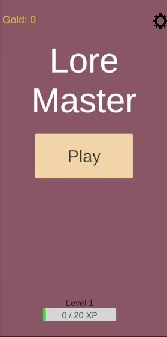
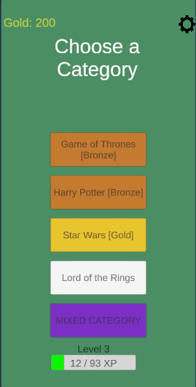
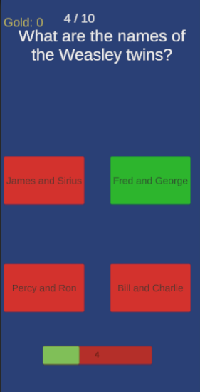
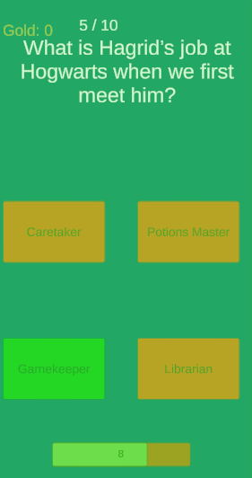
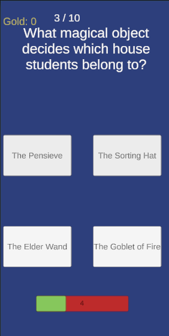
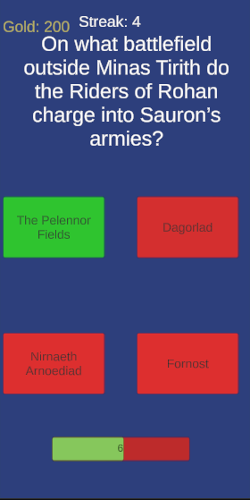
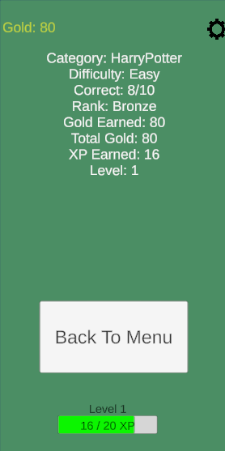

### 🧠 LoreMaster

Genre: Trivia / Quiz • Geek Culture  
Engine: Unity  
Role: Designer & Developer

## 🎯 Overview

LoreMaster is a geek-culture trivia game featuring questions from movies, series, games, and more.  
It’s designed to be playable both casually and competitively, with a light progression system and multiple modes.

## 🎮 Core Features

- Dynamic UI Navigation
  - Panel-based UI where each button click switches screens (menu, quiz, results)
  - Clear UX flow with minimal friction for players

- Randomized Quizzes
  - Questions and answer order are randomized each game
  - Difficulty can scale with the player’s level/rank

- Timer & Feedback
  - Countdown timer to add pressure to questions
  - Screen tints and SFX for correct/incorrect answers

- Economy & Progression
  - Core loop: Answer questions → Gain gold → Unlock higher levels → Earn more gold
  - Higher levels offer harder questions but better rewards

- Game Modes
  - Standard Mode: Single-category quizzes based on selected topic
  - Mixed Category Mode: Combines questions from multiple categories
  - Eternal Mode: Play until you fail, aiming for a high score

- Monetization-ready design
  - System supports potential rewarded ads, unlockable packs, or cosmetic content

## 🧩 Design Responsibilities

- Designed the **economy loop** (gold → unlock → harder quizzes → more gold)
- Implemented **UI panel logic** and button-driven navigation
- Built **randomization systems** for questions and answers
- Added **sound and visual feedback** for player actions

## 🛠️ Tech & Tools

- Unity (C#)
- UI Canvas system
- Scriptable/modeled question data structures
- Git & GitHub

## 📸 Screenshots

Intro Panel

Categories Panel (Color indicated rank earned in given category)

Quiz Gameplay & Feedback 

Quiz on Eternal Mode (Streak instead of score)

Results Panel

